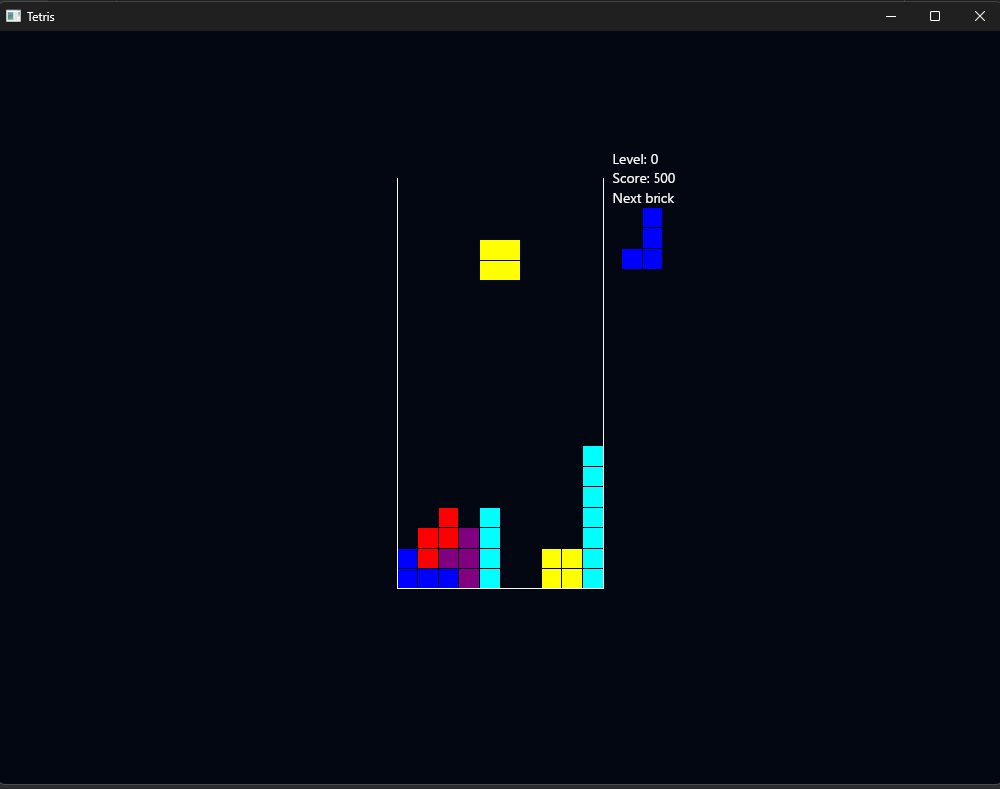

# Tetris

A classic Tetris implementation built with Rust and the Iced GUI framework.



## Features

- Classic 10×20 Tetris gameplay
- Progressive difficulty: speed increases every 10 cleared rows
- Starting speed: 800ms per row drop
- Next piece preview display
- Pause functionality to take a break
- Simple controls for an authentic Tetris experience
- Game over detection with easy restart functionality

## Controls

- **←/→**: Move tetromino left/right
- **↓**: Soft drop (accelerate downward)
- **W**: Rotate tetromino clockwise
- **Q**: Rotate tetromino counter-clockwise
- **Space**: Pause/resume game
- **Space**: Start new game / Restart after game over

## Installation

### Prerequisites

- [Rust](https://www.rust-lang.org/tools/install) (1.86.0 or newer)

### Building from source

```bash
# Clone the repository
git clone https://github.com/redmonkez12/tetris
cd tetris

# Build and run in release mode
cargo run --release
